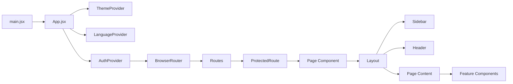
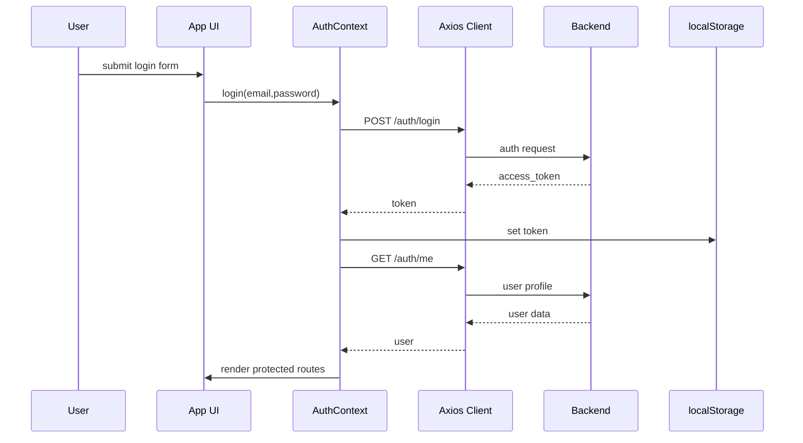

# EHR AI Frontend Architecture

## Project Overview

The EHR AI Frontend is a React-based electronic health record dashboard and operations portal built with Vite. It supports medical workflows for multiple user roles: admin, doctor, patient, pharmacist, lab technician, and radiology technician. The interface centralizes patient monitoring, lab/radiology order management, medication dispensing, financial summaries, and AI-enhanced review requests.

### Purpose
- Provide a responsive, role-aware frontend for clinical operations.
- Enable secure authentication and authorization across medical users.
- Present data-driven dashboards, forms, and management screens.
- Connect with a backend API via Axios and use token-based authentication.
- Support Arabic/English internationalization with RTL/LTR switching.

### Main Features
- Role-based dashboards and protected routes.
- Authentication: login, registration, token persistence.
- Patient monitoring, medical records, and appointment summaries.
- AI review request interface and AI analysis feedback.
- Laboratory request management, pricing, result entry, file uploads.
- Radiology scanning workflow and image report handling.
- Pharmacy prescription view, inventory, and medication orders.
- Financial earnings view, withdraw flow, and revenue summaries.
- Theme toggle, language toggle, and accessible sidebar navigation.

### User Workflow
1. Login or register with user role selection.
2. User lands on a role-appropriate dashboard.
3. Navigation is displayed dynamically by role in the sidebar.
4. Data flows from backend APIs into pages via Axios and React state.
5. ProtectedRoute ensures only authorized users access each page.
6. Users interact with cards, tables, modals, and forms.
7. Token is persisted in `localStorage`; interceptors handle auth errors.

## Tech Stack

- Framework: React 19 with Vite.
- State management: React `useState`, `useEffect`, and Context API.
- UI libraries: Heroicons, Headless UI components, Tailwind CSS.
- Styling: Tailwind CSS utility-first classes plus custom global CSS.
- Routing: `react-router-dom` v7.
- API integration: Axios with a centralized `api.js` client.
- Charts/visualization: Recharts for dashboards.
- Internationalization: i18next + react-i18next.
- Notifications: react-hot-toast.
- Forms / validation libraries present: react-hook-form, zod.

## Folder Structure Explanation

### Root files
- `package.json`: dependencies, scripts, and project metadata.
- `vite.config.js`: Vite configuration and `/api` proxy to backend.
- `README.md`: project summary and usage instructions.
- `index.html`: app entry HTML scaffold.

### `src/`
- `main.jsx`: application entry point; loads CSS and i18n.
- `App.jsx`: root application shell with providers and route definitions.

### `src/contexts/`
- `AuthContext.jsx`: authentication state, login/register/logout, token persistence, current user fetch.
- `ThemeContext.jsx`: theme selection and dark mode toggle using CSS class.
- `LanguageContext.jsx`: language switching, RTL/LTR document direction, localStorage persistence.

### `src/components/`
- `Common/`: shared UI pieces like `ProtectedRoute`, `Modal`, `Loader`, `SearchBar`, `Filter`, `ThemeToggle`.
- `Layout/`: persistent page layout with `Sidebar`, `Header`, and page wrapper `Layout`.
- Feature groups: `AI/`, `Dashboard/`, `Doctors/`, `Patients/`, `Pharmacy/`, `Lab/`, `Radiology/`, `Profile/`, `Notifications/`.

### `src/pages/`
- Route-level screens: dashboards, pages for login/register, patients, doctors, pharmacy, lab, radiology, AI reviews, financial reports, profile, and 404.

### `src/services/`
- `api.js`: Axios client configuration and interceptors.
- Domain services: `authService.js`, `doctorService.js`, `patientService.js`, `labService.js`, `pharmacyService.js`, `radiologyService.js`, `financialService.js`, `adminService.js`, `aiService.js`, `notificationService.js`, `priceService.js`, `etlService.js`.

### `src/hooks/`
- Custom hooks for search, filter, notifications, and auth helpers.

### `src/i18n/`
- Localization setup and translation resource files for Arabic and English.

### `src/styles/`
- `globals.css`: typography, custom utilities, animations, scrollbar styling, RTL support.

### `src/utils/`
- Shared helpers, constants, formatters, and validation utilities.

## UI Architecture

### Component hierarchy

The application uses a layered UI hierarchy:
- `main.jsx`
  - `App.jsx`
    - `ThemeProvider`, `LanguageProvider`, `AuthProvider`
      - `BrowserRouter`
        - `Routes`
          - `ProtectedRoute` -> page components
            - `Layout`
              - `Sidebar`
              - `Header`
              - `main` content
                - feature page content and nested components

### Data flow

- `AuthContext` stores user and token.
- `App.jsx` wraps all routes with providers.
- `ProtectedRoute` reads auth and role state from context.
- Pages fetch backend data using Axios with token headers.
- Local page-level state is managed with `useState` and updates UI directly.
- Shared components receive props from pages.

### State flow

- Global state: `AuthContext`, `ThemeContext`, `LanguageContext`.
- Local state: page-specific data for dashboards, forms, modals, tables.
- Side effects: `useEffect` is used to load data on mount and on user context changes.

### API communication

- `src/services/api.js` configures Axios with a base URL `/api/v1`.
- Request interceptor reads token from `localStorage` and attaches `Authorization: Bearer`.
- Response interceptor handles `401`, `403`, `404`, and `500` globally.
- Pages and features call endpoints via either domain services or direct `api` imports.

### Authentication flow

1. User submits login/register form.
2. `AuthContext.login()` calls `authService.login()`.
3. Token stored in `localStorage` and `AuthContext` state.
4. Current user data is fetched with `/auth/me`.
5. `ProtectedRoute` uses auth state to allow or redirect users.
6. Logout clears user state and token from localStorage.

### Protected routes

- `ProtectedRoute.jsx` enforces login and role-based access.
- `allowedRoles` and `requiredRole` props define permission gates.
- Unauthorized access is redirected to `/login` or `/`.

## Features Breakdown

### Dashboard
- Multiple dashboards based on user roles.
- Doctor dashboard aggregates patients, appointments, AI reviews, lab/radiology/medication data.
- Patient dashboard surfaces doctors, medical records, prescriptions, lab/radiology results, and AI request flows.
- Admin and financial dashboards provide revenue summaries and admin controls.

### Authentication
- Login and registration forms with theme/language toggles.
- Role-aware registration fields (doctor specialty, license, facility).
- Token persistence in `localStorage`.
- Current user verification at application load.

### Patient monitoring
- Doctor pages fetch `my-patients`, appointment histories, chronic diseases, and medical records.
- Patient pages show personal medical records, appointments, prescriptions, and complaints.
- Data cards, tables, and modals help monitor patient details.

### AI prediction UI
- AI Reviews page includes request forms, pending review lists, and mock AI response modal.
- Lab page supports AI-based test analysis via `/ai/analyze-lab`.
- The AI flow is built as an assistant layer, not a full machine learning pipeline in the frontend.

### Charts
- Recharts is included as the charting library.
- Chart components are available in `src/components/Dashboard/Chart.jsx`.
- Dashboard cards surface summarized metrics.

### Alerts
- `react-hot-toast` displays API error/success feedback.
- Axios interceptor also triggers toast messages for HTTP errors.
- UI uses badge components and status labels for warnings, success, and pending states.

### Maps
- No map or geospatial feature is present in the current workspace.

## API Integration

### Connected backend endpoints
- Authentication: `/auth/login`, `/auth/register`, `/auth/me`, `/auth/profile`, `/auth/change-password`.
- Doctors: `/doctors/my-patients`, `/doctors/statistics`, `/appointments/my`, `/doctors/all`.
- Patients: `/patients`, `/patients/medical-records`, `/patients/chronic-diseases`.
- Pharmacy: `/pharmacy/prescriptions`, `/pharmacy/medications`.
- Lab: `/lab/requests`, `/lab/test-types`, `/lab/payments`, `/lab/upload-files`, `/lab/requests/{id}/complete`.
- Radiology: `/radiology/scan-types`, `/radiology/my-results`.
- AI: `/ai/analyze-lab`, `/ai/reviews/pending`, `/ai/reviews/my-requests`, `/ai/reviews/request`.
- Notifications and admin flows are defined in `src/utils/constants.js` and services.

### Request flow
- Pages call domain endpoints using `api.get`, `api.post`, `api.put`, `api.delete`.
- Requests are proxied to `http://localhost:8000` through Vite config.
- Authentication headers are automatically attached.
- Forms and actions submit JSON payloads for requests, payments, and lab/radiology updates.

### Response handling
- Successful responses populate component state.
- Errors are caught locally and surfaced through toast messages.
- 401 and unauthorized errors trigger a redirect to login.

## Performance

### Current optimizations
- Vite provides fast development builds and HMR.
- Tailwind CSS provides optimized utility styling.
- `React.memo` is not used widely; the app relies on standard React render patterns.
- `Promise.all` batches related data fetches in some dashboards.

### Opportunities for improvement
- Introduce route-level code splitting with `React.lazy` and `Suspense`.
- Consolidate repeated state logic with custom hooks or a state management layer.
- Use memoized selectors and `useMemo`/`useCallback` for expensive render logic.
- Convert domain APIs to service wrappers uniformly.
- Use centralized constants for endpoint paths consistently.
- Replace inline mock delays in pages with backend-driven data.

## Improvements

### UI/UX suggestions
- Add a universal notification drawer component.
- Improve mobile sidebar UX and menu state persistence.
- Add consistent loading placeholders and skeleton states.
- Add stronger form validation using `react-hook-form` and `zod`.
- Provide user-friendly error pages for role mismatches.

### Refactoring ideas
- Move repeated modal form patterns into reusable components.
- Standardize data fetching with a custom hook like `useApi`.
- Create a `useAuthRedirect` hook for login redirect logic.
- Consolidate page-level state into feature slices when possible.
- Use `src/services/*.js` consistently rather than calling `api` directly in pages.

### Scalability improvements
- Add centralized state management with Zustand, Redux Toolkit, or React Query for caching.
- Modularize feature pages into folder-level routes and lazy load them.
- Expand the `services/` layer to expose typed domain APIs.
- Introduce feature-based folders for large flows like `Lab`, `Radiology`, `AI`, and `Pharmacy`.
- Add unit tests for context providers, route guards, and major pages.

## Mermaid Diagrams

### High-level architecture

### Auth and API flow

