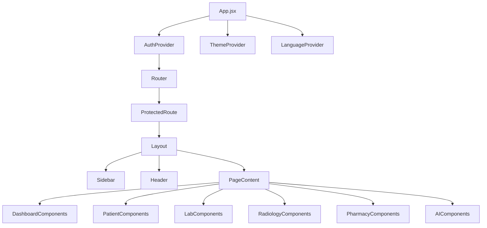

# Component Structure

## Overview

The EHR AI Frontend is built with reusable page-level components, shared layout pieces, and domain-specific feature components. The component tree is organized by feature area and prioritized for role-based rendering.

## Root and Layout Components

- `src/main.jsx`
  - Application bootstrap and provider mounting.
- `src/App.jsx`
  - Router definition and protected route configuration.
  - Wraps the entire app with `ThemeProvider`, `LanguageProvider`, and `AuthProvider`.
- `src/components/Layout/Layout.jsx`
  - Handles page layout and responsive sidebar state.
  - Embeds `Sidebar` and `Header` around page content.
- `src/components/Layout/Sidebar.jsx`
  - Role-aware navigation menu.
  - Theme and language toggles.
  - Logout button.
- `src/components/Layout/Header.jsx`
  - Sticky top bar with toggle and avatar.
  - Notification action and page heading.

## Common Components

- `src/components/Common/ProtectedRoute.jsx`
  - Guard for authenticated access and role-based routing.
- `src/components/Common/Modal.jsx`
  - Generic modal wrapper used across feature pages.
- `src/components/Common/Loader.jsx`
  - Reusable loading spinner.
- `src/components/Common/SearchBar.jsx`
  - Search UI input.
- `src/components/Common/Filter.jsx`
  - Filter controls.
- `src/components/Common/ThemeToggle.jsx`
  - Theme switch component.

## Dashboard Components

- `src/components/Dashboard/Chart.jsx`
  - Chart wrapper using Recharts.
- `src/components/Dashboard/StatsCard.jsx`
  - Information card for metrics.
- `src/components/Dashboard/RecentActivity.jsx`
  - Activity feed.

## AI Components

- `src/components/AI/AIResponse.jsx`
  - Displays AI review or analysis output.
- `src/components/AI/AIReviewRequest.jsx`
  - Request form for AI review.
- `src/components/AI/PendingReviews.jsx`
  - List of pending AI review requests.

## Doctors Components

- `src/components/Doctors/DoctorCard.jsx`
  - Single doctor item card.
- `src/components/Doctors/DoctorList.jsx`
  - Doctor listing view.
- `src/components/Doctors/DoctorSchedule.jsx`
  - Schedule and appointments UI.
- `src/components/Doctors/DoctorStats.jsx`
  - Doctor-specific summary stats.

## Patients Components

- `src/components/Patients/PatientCard.jsx`
  - Patient summary card.
- `src/components/Patients/PatientDetails.jsx`
  - Detailed patient record view.
- `src/components/Patients/PatientList.jsx`
  - Patient list interface.
- `src/components/Patients/MedicalRecordForm.jsx`
  - Editable medical record form.
- `src/components/Patients/MedicalRecordsList.jsx`
  - Patient medical records list.

## Pharmacy Components

- `src/components/Pharmacy/Inventory.jsx`
  - Medication stock and inventory management.
- `src/components/Pharmacy/MedicationCard.jsx`
  - Medication item card.
- `src/components/Pharmacy/MedicationList.jsx`
  - Medication list view.
- `src/components/Pharmacy/PrescriptionForm.jsx`
  - Prescription creation form.
- `src/components/Pharmacy/PrescriptionList.jsx`
  - Prescription table.

## Lab Components

- `src/components/Lab/TestList.jsx`
  - Test order list view.
- `src/components/Lab/TestRequestForm.jsx`
  - Request form for lab tests.
- `src/components/Lab/TestResult.jsx`
  - Test result display component.

## Radiology Components

- `src/components/Radiology/ScanList.jsx`
  - Radiology scan order list.
- `src/components/Radiology/ScanRequestForm.jsx`
  - Radiology request form.
- `src/components/Radiology/ScanResult.jsx`
  - Scan result viewer.

## Profile Components

- `src/components/Profile/EditProfile.jsx`
  - Profile editing form.
- `src/components/Profile/ChangePassword.jsx`
  - Password update form.

## Notifications Components

- `src/components/Notifications/NotificationBell.jsx`
  - Bell icon and unread badge UI.
- `src/components/Notifications/NotificationList.jsx`
  - Notification list panel.

## Services

The `src/services/` layer is responsible for backend communication and domain abstractions.
- `api.js`: Axios client and interceptors.
- `authService.js`: login/register/profile actions.
- `doctorService.js`, `patientService.js`, `labService.js`, `pharmacyService.js`, `radiologyService.js`, `financialService.js`, `adminService.js`, `aiService.js`, `notificationService.js`, `priceService.js`, `etlService.js`: domain-specific API operations.

## Hooks

- `src/hooks/useAuth.js`: shared auth helper functions.
- `src/hooks/useFilter.js`: array filtering support.
- `src/hooks/useNotifications.js`: notification state logic.
- `src/hooks/useSearch.js`: search and filter logic.

## Utility Files

- `src/utils/constants.js`: endpoint and role constants.
- `src/utils/formatters.js`: formatting helpers.
- `src/utils/helpers.js`: generic utilities.
- `src/utils/validations.js`: validation utilities.

## Component Hierarchy Diagram

## Notes

- Shared common components are used across feature pages to reduce duplication.
- Layout composition is consistent across protected routes.
- Current architecture is mostly page-driven with local state per page.
- Future refactors can introduce domain-level containers and shared data hooks.
